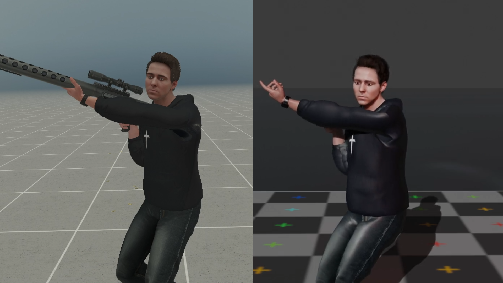
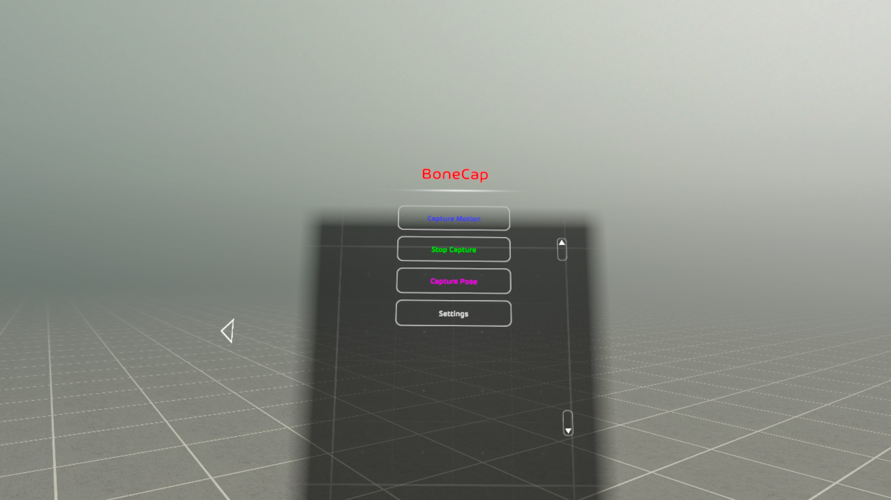
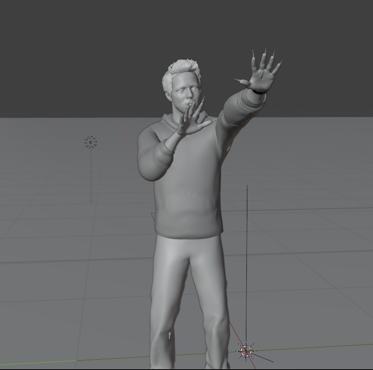
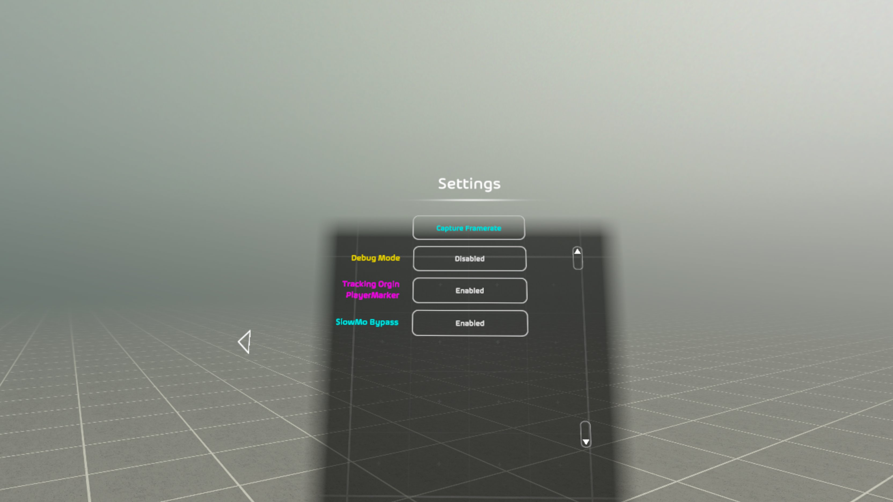
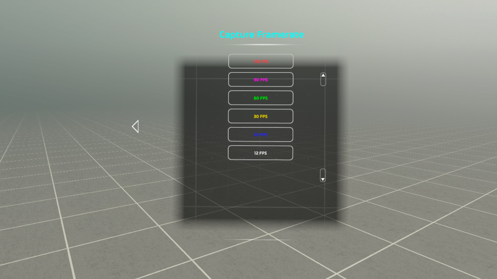
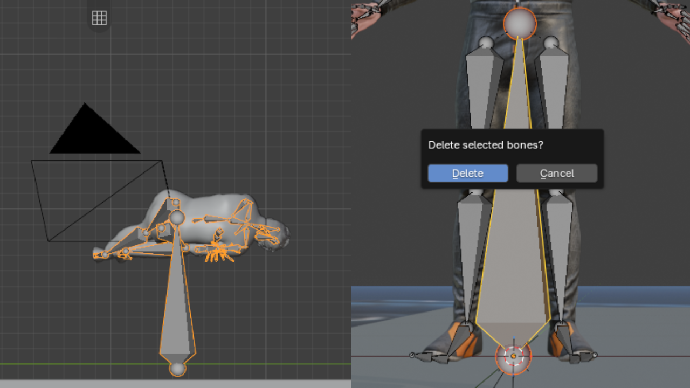

<h1 align="center">BONECAP</h1>

Mocap for BONELAB. Record yourself in game, put it in Blender.

  
  
  

## What is it

BoneCap records your avatar while you play. Open it in Blender and your avatar moves just like you did in game.

Use it for animations, renders, videos, or your own mods.

## What you need

- [MelonLoader](https://melonwiki.xyz/) 0.7+
- [BoneLib](https://thunderstore.io/c/bonelab/p/gnonme/BoneLib/)
- [Blender](https://www.blender.org/download/) 5.2.2+

## Install

1. Put `BoneCap.dll` in `BONELAB\Mods`. Delete the old one if you have it.
2. In Blender: Edit-Preferences-Add-ons-arrow in the top right-Install from Disk. pick `bonecap_blender.py`. Make sure it's checked.

Updating the mod? Update the Blender add-on too.

## How to record

1. Load into a map
2. BoneMenu > BoneCap
3. Hit **Capture Motion**
4. Move around
5. Hit **Stop Capture**

Switching avatars or maps stops and saves it for you.
Recordings go to `BONELAB\UserData\BoneCap\`.

### Capture Pose?

Click it and wait till the 3s timer is up, it'll save to
`BONELAB\UserData\BoneCap\Poses`-pc
`sdcard\MelonLoader\com.StressLevelZero.BONELAB\UserData\BoneCap\Poses` -Quest

## Does it work on Quest?

YES, But I didn't make it with quest in mind. Recordings will just be in your melon loader folder on sidequest.
Works tho, i've used it a few times.
Recordings Go to `sdcard\MelonLoader\com.StressLevelZero.BONELAB\UserData\BoneCap`.

### Settings

- **Capture Framerate**: pick anywhere from 12 to 120 FPS. 60 is default. Higher is smoother but bigger files. Stop recording before changing it.
- **Tracking Origin PlayerMarker**: leave it on. Keeps your recordings lined up with the map.
- **SlowMo Bypass**: turn it on if you want slowmo to play at full speed in Blender. Leave it off to record slowmo as slowmo.

## Putting it in Blender

1. Import your avatar's FBX
2. Click the armature (the skeleton, not the mesh)
3. Press N, go to the BoneCap tab
4. Hit **Apply BoneCap To Avatar** and pick your recording

Use the same model you uploaded to BONELAB or some bones won't move.

No model? Import with nothing selected and it makes a skeleton for you.

## Using it in Unity

Export your animated avatar as an FBX and use it in Unity for your mods.

1. Select your avatar in Blender
2. File > Export > FBX
3. Turn on **Selected Objects** and **Bake Animation**
4. Drag it into Unity

## Works with

- PhysicsFingers
- Lean Lab
- RagdollPlayer

Join the [Discord](https://discord.gg/Wx4y5CZU6n) if you want to suggest support fixxes for another mod.

## Problems

**Body is offset / big bone sticking out**
Delete the root bone (the one big bone on the rig). Edit Mode, click it, X, Delete.

**"Rig or Avatar Not Found"**
Your avatar didn't finish loading. Wait a sec and try again.

**Avatar doesn't move around in Blender**
Update the Blender add-on and import again.

**Avatar is sideways, tiny, or huge**
Click the armature, not the mesh, before importing.

**Some bones don't move**
Your Blender model or rig is different from the one in game. Use the same one.

**"Scene Root not available"**
The map has no spawn point. It still records, but it won't line up with the map in Blender.

**Found a bug?**
Make a thread in the support channel on the [Discord](https://discord.gg/Wx4y5CZU6n). Send your recording, your Melon log, and a screenshot/video. If you can, turn on Debug Mode and try to make it happen again. You don't have to, it just helps.

## Credits

Made by TheVrEnthusiast. Uses [BoneLib](https://github.com/yowchap/BoneLib) and [MelonLoader](https://github.com/LavaGang/MelonLoader). Thanks to everyone who tested.

BoneCap isn't open source. It's 8 months of work and I'm still working on it. Maybe later.
